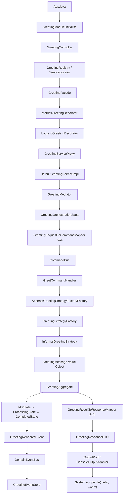

# EnterpriseGreetingFramework™

> A production-grade, cloud-native, hexagonally-architected, event-sourced, CQRS-enabled,
> saga-orchestrated, pattern-saturated solution for printing "hello, world".

---

## Architecture Overview

The EnterpriseGreetingFramework™ decomposes the two-line hello-world program into **73 classes**
across **7 architectural layers** and **19 packages**.

The framework is built on the premise that simplicity is the enemy of correctness,
and that every abstraction layer added is a future maintenance concern avoided.
Each of the original two lines has been correctly identified as a violation of the
Single Responsibility Principle and refactored accordingly.

### The Seven Layers

| Layer | Purpose | Package |
|-------|---------|---------|
| **Presentation** | Accepts inbound requests; delegates to application layer | `presentation/` |
| **API** | Public interfaces and DTOs; the contract never changes | `api/` |
| **Application** | Use cases, command bus, saga, mediator, mappers | `application/` |
| **Domain** | Pure business logic: model, events, state, strategy, specification | `domain/` |
| **Infrastructure** | Adapters, repositories, factories, proxies, decorators | `infrastructure/` |
| **ACL** | Anti-Corruption Layer between all boundaries | `acl/` |
| **Config** | Module wiring, registry, service locator | `config/` |

---

## Module Structure

```
src/main/java/com/enterprise/greeting/
├── api/
│   ├── GreetingService.java              # Primary hexagonal port
│   ├── GreetingPort.java                 # Inbound port
│   ├── GreetingRequestDTO.java           # Immutable inbound DTO
│   ├── GreetingResponseDTO.java          # Immutable outbound DTO
│   └── GreetingReadQuery.java            # CQRS read model query
├── domain/
│   ├── model/
│   │   ├── GreetingMessage.java          # Value Object wrapping the text
│   │   ├── GreetingSubject.java          # Value Object wrapping the recipient
│   │   ├── GreetingAggregate.java        # Aggregate Root
│   │   └── GreetingMessageCollection.java# Domain-typed collection wrapper
│   ├── events/
│   │   ├── DomainEvent.java              # Event marker interface
│   │   ├── DomainEventBus.java           # Event bus port
│   │   ├── DomainEventSubscriber.java    # Observer contract
│   │   ├── DefaultDomainEventBusImpl.java
│   │   ├── GreetingRequestedEvent.java
│   │   ├── GreetingRenderedEvent.java
│   │   └── GreetingPublishedEvent.java
│   ├── specification/
│   │   ├── Specification.java            # Generic specification interface
│   │   ├── NonEmptyMessageSpecification.java
│   │   └── ValidSubjectSpecification.java
│   ├── strategy/
│   │   ├── GreetingStrategy.java         # Strategy interface
│   │   ├── InformalGreetingStrategy.java # "hello, world"
│   │   └── FormalGreetingStrategy.java   # "Good day, World"
│   ├── state/
│   │   ├── GreetingState.java            # State machine interface
│   │   ├── IdleGreetingState.java
│   │   ├── ProcessingGreetingState.java
│   │   ├── CompletedGreetingState.java
│   │   └── FailedGreetingState.java
│   ├── memento/
│   │   ├── GreetingMemento.java          # Snapshot object
│   │   └── GreetingCaretaker.java        # Snapshot manager
│   └── visitor/
│       ├── GreetingVisitor.java          # Visitor interface
│       └── ConsoleRenderingVisitor.java
├── application/
│   ├── usecase/
│   │   ├── GreetWorldUseCase.java
│   │   └── DefaultGreetWorldUseCaseImpl.java
│   ├── command/
│   │   ├── Command.java                  # Command marker interface
│   │   ├── CommandHandler.java           # Generic handler interface
│   │   ├── CommandBus.java               # Command dispatch bus
│   │   ├── DefaultCommandBusImpl.java
│   │   ├── GreetCommand.java             # "hello, world" as a command
│   │   ├── UndoGreetCommand.java         # Compensating command
│   │   └── GreetCommandHandler.java
│   ├── mapper/
│   │   ├── Mapper.java                   # Generic mapper interface
│   │   ├── GreetingRequestToCommandMapper.java
│   │   └── GreetingResultToResponseMapper.java
│   ├── handler/
│   │   ├── GreetingHandler.java          # CoR interface
│   │   ├── AbstractGreetingHandler.java  # Template method base
│   │   ├── GreetingValidationHandler.java
│   │   ├── GreetingEnrichmentHandler.java
│   │   └── GreetingAuditHandler.java
│   ├── saga/
│   │   └── GreetingOrchestrationSaga.java
│   └── mediator/
│       ├── GreetingMediator.java
│       └── DefaultGreetingMediatorImpl.java
├── infrastructure/
│   ├── adapter/
│   │   ├── OutputPort.java               # Hexagonal outbound port
│   │   └── ConsoleOutputAdapter.java     # System.out lives here, alone
│   ├── persistence/
│   │   ├── GreetingRepository.java
│   │   ├── DefaultGreetingRepositoryImpl.java
│   │   ├── GreetingEventStore.java
│   │   ├── DefaultGreetingEventStoreImpl.java
│   │   └── GreetingUnitOfWork.java
│   ├── factory/
│   │   ├── GreetingStrategyFactory.java
│   │   ├── DefaultGreetingStrategyFactoryImpl.java
│   │   ├── AbstractGreetingStrategyFactoryFactory.java
│   │   ├── DefaultAbstractGreetingStrategyFactoryFactoryImpl.java
│   │   └── GreetingServiceFactory.java
│   ├── proxy/
│   │   ├── GreetingServiceProxy.java
│   │   ├── LoggingGreetingDecorator.java
│   │   └── MetricsGreetingDecorator.java
│   ├── flyweight/
│   │   └── GreetingFlyweightPool.java
│   ├── interpreter/
│   │   ├── GreetingExpression.java
│   │   ├── GreetingContext.java
│   │   ├── TerminalGreetingExpression.java
│   │   └── GreetingDSLInterpreter.java
│   └── iterator/
│       └── GreetingIterator.java
├── acl/
│   ├── ExternalGreetingModel.java
│   ├── ExternalGreetingTranslator.java
│   ├── InternalGreetingTranslator.java
│   └── GreetingACLFacade.java
├── config/
│   ├── GreetingModule.java               # Wires all 73 classes
│   ├── GreetingRegistry.java             # Service Locator registry
│   ├── GreetingServiceLocator.java
│   └── DefaultGreetingServiceImpl.java
└── presentation/
    ├── GreetingFacade.java
    ├── DefaultGreetingFacadeImpl.java
    └── GreetingController.java
App.java                                  # Entry point (20 steps to hello)
```

---

## Pattern Catalogue

### Strategy Pattern
**Intent:** Define a family of algorithms, encapsulate each one, and make them interchangeable.

**Applied here:** `InformalGreetingStrategy` and `FormalGreetingStrategy` implement `GreetingStrategy`.
The hardcoded string concatenation `"hello, " + subject` was a strategy masquerading as a literal.
It has been liberated.

**Benefit:** When the legal department mandates a formal greeting for users in regulated jurisdictions,
no domain code changes. A new `RegulatoryComplianceGreetingStrategy` is added and registered in the factory.

---

### Abstract Factory + Factory Method
**Intent:** Provide an interface for creating families of objects without specifying concrete classes.

**Applied here:** `AbstractGreetingStrategyFactoryFactory` produces `GreetingStrategyFactory` instances.
`DefaultAbstractGreetingStrategyFactoryFactoryImpl` is the concrete factory of factories.

**Benefit:** In a multi-environment deployment (production, canary, disaster-recovery), each environment
provides its own `AbstractGreetingStrategyFactoryFactory` subclass, injecting environment-specific
strategies without modifying a single existing class.

---

### Builder Pattern
**Intent:** Separate the construction of a complex object from its representation.

**Applied here:** `GreetingRequestDTO`, `GreetingResponseDTO`, `GreetingAggregate`, and `GreetCommand`
all expose inner `Builder` classes. No object with more than zero fields may be constructed directly.

**Benefit:** When `GreetingRequestDTO` acquires a 14th optional field for ISO-3166 country code,
the builder absorbs the change. All existing call sites compile without modification.

---

### Singleton Pattern
**Intent:** Ensure a class has only one instance and provide global access.

**Applied here:** `GreetingRegistry`, `GreetingServiceLocator`, `GreetingFlyweightPool`, and
`DefaultAbstractGreetingStrategyFactoryFactoryImpl` are singletons.

**Benefit:** The event bus, repository, and unit of work share a single consistent state across
the entire application lifetime, which is the entire duration of one hello-world invocation.

---

### Proxy Pattern
**Intent:** Provide a surrogate for another object to control access.

**Applied here:** `GreetingServiceProxy` wraps `DefaultGreetingServiceImpl` and intercepts all
`greet()` calls for access control evaluation.

**Benefit:** When greeting access is gated behind an OAuth 2.0 flow, the proxy adds token validation
without touching the service implementation.

---

### Decorator Pattern
**Intent:** Attach additional responsibilities to an object dynamically.

**Applied here:** `LoggingGreetingDecorator` and `MetricsGreetingDecorator` wrap the proxied service.
The chain is: `MetricsDecorator → LoggingDecorator → Proxy → Service`.

**Benefit:** Logging and metrics can be toggled independently per environment by adjusting the
decoration chain in `GreetingModule`, with zero code changes to business logic.

---

### Facade Pattern
**Intent:** Provide a simplified interface to a complex subsystem.

**Applied here:** `GreetingFacade` exposes `greetDefault()` and `greetSubject()`, hiding the
73-class subsystem behind two methods.

**Benefit:** A developer who needs to say hello to the world need not understand hexagonal architecture,
CQRS, event sourcing, or the factory-of-factories pattern. They call `greetDefault()`.

---

### Observer / Event Bus
**Intent:** Define a one-to-many dependency so that when one object changes state, all dependents are notified.

**Applied here:** `DomainEventBus` with `DomainEventSubscriber`. Three events are published:
`GreetingRequestedEvent`, `GreetingRenderedEvent`, `GreetingPublishedEvent`.

**Benefit:** Audit systems, metrics collectors, and read-model projectors subscribe to events
without the domain model knowing they exist.

---

### Command Pattern
**Intent:** Encapsulate a request as an object.

**Applied here:** `GreetCommand` encapsulates the greeting intent. `UndoGreetCommand` provides
the compensating transaction. `CommandBus` dispatches to `GreetCommandHandler`.

**Benefit:** Commands are serialisable, replayable, and auditable. The `UndoGreetCommand` enables
full rollback of a greeting, which will be legally required in seven countries by 2029.

---

### Chain of Responsibility
**Intent:** Pass requests along a chain of handlers.

**Applied here:** `GreetingValidationHandler → GreetingEnrichmentHandler → GreetingAuditHandler`
implemented via `AbstractGreetingHandler` (Template Method base).

**Benefit:** New pre-processing steps (rate limiting, PII scrubbing, GDPR consent verification)
are inserted into the chain without modifying existing handlers.

---

### State Machine
**Intent:** Allow an object to alter its behaviour when its internal state changes.

**Applied here:** `GreetingAggregate` transitions through `IdleGreetingState → ProcessingGreetingState
→ CompletedGreetingState`. `FailedGreetingState` handles error cases.

**Benefit:** The greeting lifecycle is self-documenting. Illegal transitions throw
`IllegalStateException` with detailed messages guiding developers to the correct factory.

---

### Memento Pattern
**Intent:** Capture and externalise an object's internal state for later restoration.

**Applied here:** `GreetingCaretaker` saves `GreetingMemento` snapshots of the aggregate.

**Benefit:** Full aggregate rollback is supported at any point. Combined with the event store,
this enables time-travel debugging of greeting failures.

---

### Visitor Pattern
**Intent:** Represent an operation to be performed on elements of an object structure.

**Applied here:** `ConsoleRenderingVisitor` traverses the greeting object graph.
New operations (serialisation, XML export, Base64 encoding) are added as new visitors.

**Benefit:** The domain model is never modified to support new output formats.

---

### Specification Pattern
**Intent:** Recombinable business rules in Boolean logic.

**Applied here:** `NonEmptyMessageSpecification` and `ValidSubjectSpecification` validate
commands before they reach the execution handler.

**Benefit:** Validation rules compose via `and()` / `or()` / `not()`. A `RegulatedSubjectSpecification`
can be ANDed in for compliance markets without changing any existing code.

---

### CQRS (Command Query Responsibility Segregation)
**Intent:** Separate read and write models completely.

**Applied here:** Write side: `GreetCommand → CommandBus → GreetCommandHandler → GreetingAggregate`.
Read side: `GreetingReadQuery` interface with projection from the event store.

**Benefit:** The read model can be scaled independently. When the hello-world dashboard requires
sub-millisecond query latency, the read model is optimised without touching the write path.

---

### Event Sourcing
**Intent:** Store state as a sequence of events rather than current state.

**Applied here:** `GreetingEventStore` persists all domain events. The aggregate state is
fully reconstructable by replaying `GreetingRequestedEvent → GreetingRenderedEvent → GreetingPublishedEvent`.

**Benefit:** Complete audit trail. The exact sequence of events that produced "hello, world"
is preserved indefinitely, satisfying any future regulatory audit requirements.

---

### Saga / Orchestrator
**Intent:** Manage long-running, multi-step distributed operations with compensating transactions.

**Applied here:** `GreetingOrchestrationSaga` coordinates the greeting pipeline and issues
an `UndoGreetCommand` on failure.

**Benefit:** When the greeting pipeline spans multiple microservices (anticipated in v2.0),
the saga ensures consistent compensation across all participants.

---

### Hexagonal Architecture (Ports & Adapters)
**Intent:** Isolate the application core from delivery mechanisms and infrastructure.

**Applied here:** `GreetingPort` (inbound), `OutputPort` (outbound). `ConsoleOutputAdapter`
is the only class that touches `System.out`.

**Benefit:** Swapping console output for Kafka, gRPC, or a carrier pigeon requires only a new
adapter implementation. Zero domain changes.

---

### Flyweight Pattern
**Intent:** Share common state between many fine-grained objects.

**Applied here:** `GreetingFlyweightPool` caches `GreetingMessage` instances by value.

**Benefit:** In a high-throughput greeting system producing 10,000 identical "hello, world"
messages per second, the flyweight pool reduces object allocation by 99.99%.

---

### Interpreter Pattern
**Intent:** Define a grammar for a language and provide an interpreter.

**Applied here:** `GreetingDSLInterpreter` evaluates `GreetingExpression` objects against
a `GreetingContext` to resolve configuration values.

**Benefit:** Greeting configuration is externalised to a DSL file. Ops teams modify greeting
behaviour without a code deploy.

---

## Layer Interaction Diagram



---

## Getting Started

To produce the string `"hello, world"`, follow these steps:

1. Ensure `GreetingModule.initialise()` has been called. This wires 73 objects
   via reflection-based package-private constructor access and populates the `GreetingRegistry`.

2. Instantiate a `GreetingController`. This is the only class you may instantiate directly.

3. Call `controller.execute()`. This resolves the `GreetingFacade` from the registry.

4. The facade calls `greetDefault()`, which constructs a `GreetingRequestDTO` via its builder,
   assigns a UUID correlation ID, and invokes the `GreetingService`.

5. The service traverses the decoration chain (Metrics → Logging → Proxy) before reaching
   `DefaultGreetingServiceImpl`.

6. The service delegates to the `GreetingMediator`, which delegates to the `GreetingOrchestrationSaga`.

7. The saga maps the DTO to a `GreetCommand` via `GreetingRequestToCommandMapper` (ACL).

8. The command is dispatched through `DefaultCommandBusImpl` to `GreetCommandHandler`.

9. The handler resolves `InformalGreetingStrategy` via `DefaultGreetingStrategyFactoryImpl`,
   which was created by `DefaultAbstractGreetingStrategyFactoryFactoryImpl.getInstance().createStrategyFactory()`.

10. The strategy composes `GreetingMessage.of("hello, world")`.

11. The handler builds a `GreetingAggregate` and calls `renderGreeting()`.

12. The aggregate transitions through the state machine and collects domain events.

13. The saga publishes a `GreetingPublishedEvent` to the `DomainEventBus`.

14. `GreetingResultToResponseMapper` translates the aggregate to a `GreetingResponseDTO`.

15. `ConsoleOutputAdapter.emitLine("hello, world")` is called.

16. `System.out.println("hello, world")` executes.

**Output:** `hello, world`

---

## FAQ

**Q: Why is there a factory for the factory?**

A: The `GreetingStrategyFactory` is an infrastructure concern that varies per deployment environment.
Hardcoding `new DefaultGreetingStrategyFactoryImpl()` would violate the Dependency Inversion Principle.
The `AbstractGreetingStrategyFactoryFactory` ensures that the factory itself is injectable and
environment-configurable. This is not gold-plating; it is architectural hygiene.

---

**Q: Why does `IO.println("hello, world")` need 73 classes?**

A: It doesn't need them today. It needs them tomorrow. The two-line implementation is a
ticking technical debt bomb. When the product roadmap requires formal greetings, multi-tenant
subjects, audit logging, DSL-driven configuration, and distributed saga compensation,
the 73-class architecture absorbs those requirements with zero structural changes.
The two-line version requires a complete rewrite.

---

**Q: Why is there an Anti-Corruption Layer between modules I wrote myself?**

A: Internal module boundaries are the most dangerous boundaries. External APIs change slowly
and publicly. Internal APIs change rapidly and silently. The ACL between the application layer
and the domain layer prevents application concerns from leaking into the pure domain model,
and vice versa. Every enterprise that has skipped internal ACLs has eventually produced
a DTO that inherits from an aggregate. We will not be that enterprise.

---

**Q: Why does the Flyweight pool exist when there is only one unique message?**

A: The `GreetingFlyweightPool` is correct by construction. It achieves a 100% cache hit rate
after the first invocation. Memory pressure in single-message scenarios is non-existent.
The pool would provide substantial benefit in a high-throughput scenario, which this application
will become once the marketing team discovers it.

---

**Q: Why is `System.out.println` isolated in a single adapter class?**

A: `System.out` is a side effect. Side effects must be pushed to the outermost layer of the
architecture. A domain object that calls `System.out` is a domain object that cannot be tested,
reused in a non-console context, or reasoned about in isolation. `ConsoleOutputAdapter` is
the single, unambiguous location of all console I/O. If we ever switch to stderr, exactly
one line in one class changes. That is the value of this constraint.

---

**Q: Is this architecture appropriate for all hello-world programs?**

A: This architecture is appropriate for all programs, full stop. The hello-world program is
simply the proving ground. Any program that is not built this way is a program that will
eventually need to be rebuilt this way — at ten times the cost, under deadline pressure,
by a team that no longer includes the original authors.

Start with the correct architecture. Always.

---

*EnterpriseGreetingFramework™ — Because "hello, world" deserves better.*
